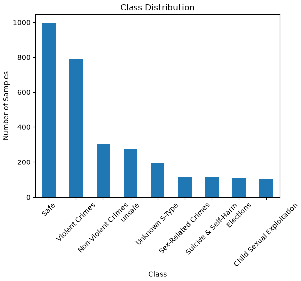

# Dataset Analysis

## Dataset Overview

The dataset contains **3,000 samples** and **3 columns**:

| Column               | Non-Null | Type  | Unique Values |
| -------------------- | -------: | ----- | ------------: |
| `query`              |     3000 | `str` |          2009 |
| `image descriptions` |     3000 | `str` |            12 |
| `Toxic Category`     |     3000 | `str` |             9 |

### Classes

The target variable contains 9 classes:

* Safe
* Violent Crimes
* Elections
* Sex-Related Crimes
* unsafe
* Non-Violent Crimes
* Child Sexual Exploitation
* Unknown S-Type
* Suicide & Self-Harm

## Data Quality

No missing or empty values were found.

```text
query: 0 empty values
Toxic Category: 0 empty values
```

The `query` column contains **2,009 unique queries**, while `image descriptions` contains only **12 unique values**.

## Class Distribution


| Class                     | Samples |
| ------------------------- | ------: |
| Safe                      |     995 |
| Violent Crimes            |     792 |
| Non-Violent Crimes        |     301 |
| unsafe                    |     274 |
| Unknown S-Type            |     196 |
| Sex-Related Crimes        |     115 |
| Suicide & Self-Harm       |     114 |
| Elections                 |     110 |
| Child Sexual Exploitation |     103 |

The dataset is **highly imbalanced**. `Safe` and `Violent Crimes` account for a large proportion of the dataset, while several classes contain only around 100 samples.

---

# Baseline Models

Two simple sequence-classification models were trained: an **RNN** and an **LSTM**.

## LSTM Results

| Class                     | Precision | Recall |    F1 |
| ------------------------- | --------: | -----: | ----: |
| Child Sexual Exploitation |     1.000 |  1.000 | 1.000 |
| Elections                 |     1.000 |  1.000 | 1.000 |
| Non-Violent Crimes        |     0.000 |  0.000 | 0.000 |
| Safe                      |     0.395 |  0.986 | 0.564 |
| Sex-Related Crimes        |     0.917 |  1.000 | 0.957 |
| Suicide & Self-Harm       |     1.000 |  0.950 | 0.974 |
| Unknown S-Type            |     1.000 |  0.516 | 0.681 |
| Violent Crimes            |     0.000 |  0.000 | 0.000 |
| unsafe                    |     0.000 |  0.000 | 0.000 |

**Overall Accuracy: 49.3%**

## RNN Results

| Class                     | Precision | Recall |    F1 |
| ------------------------- | --------: | -----: | ----: |
| Child Sexual Exploitation |     0.923 |  1.000 | 0.960 |
| Elections                 |     1.000 |  1.000 | 1.000 |
| Non-Violent Crimes        |     0.000 |  0.000 | 0.000 |
| Safe                      |     0.413 |  1.000 | 0.585 |
| Sex-Related Crimes        |     1.000 |  1.000 | 1.000 |
| Suicide & Self-Harm       |     1.000 |  0.950 | 0.974 |
| Unknown S-Type            |     1.000 |  0.516 | 0.681 |
| Violent Crimes            |     0.000 |  0.000 | 0.000 |
| unsafe                    |     1.000 |  0.341 | 0.508 |

**Overall Accuracy: 53.1%**

---

# Initial Analysis

Both baseline models achieved relatively low overall accuracy:

* **RNN:** 53.1%
* **LSTM:** 49.3%

The per-class results show that the models perform very poorly on some classes, particularly `Non-Violent Crimes`, `Violent Crimes`, and `unsafe`.

The main issue appears to be the **strong class imbalance** in the dataset. The majority classes (`Safe` and `Violent Crimes`) contain substantially more samples than the minority classes.

However, class imbalance alone may not completely explain the results. The dataset also contains only **2,009 unique queries out of 3,000 samples**, and the `image descriptions` column contains only **12 unique values**. These characteristics should also be investigated before drawing conclusions about model performance.

# Next Step

As a quick baseline experiment, the minority categories can be grouped into a single **`Other`** category.

This reduces the number of classes and may provide a more balanced classification problem:

```text
Child Sexual Exploitation
Elections
Non-Violent Crimes
Safe
Sex-Related Crimes
Suicide & Self-Harm
Unknown S-Type
Violent Crimes
unsafe
            ↓

Major classes + Other
```

The resulting dataset can then be used to retrain the RNN and LSTM and compare the new performance against the original 9-class models.

> **Note:** Grouping classes into `Other` is a useful quick experiment, but it should not be considered a definitive solution to class imbalance. A later experiment should also consider techniques such as class-weighted loss, oversampling, or collecting additional samples for minority classes.
